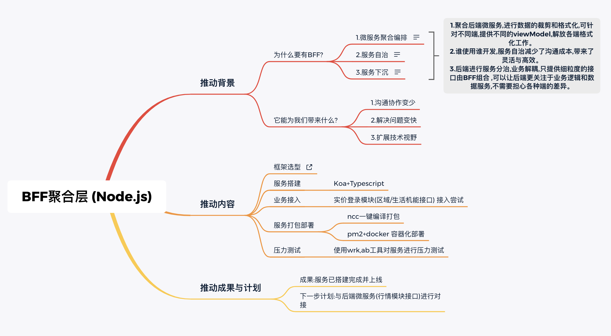

### BFF(node.js)层实践心得分享

### 1. 推动背景
#### 为什么要有BFF？
- 微服务聚合编排
聚合后端微服务,进行数据的裁剪和格式化,可针对不同端,提供不同的viewModel,解放各端格式化工作。
- 服务自治
谁使用谁开发,服务自治减少了沟通成本,带来了灵活与高效。
- 服务下沉
后端进行服务分治,业务解耦,只提供细粒度的接口由BFF组合 ,可以让后端更关注于业务逻辑和数据服务,不需要担心各种端的差异。
#### 它能为我们带来什么?
- 沟通协作变少
- 解决问题变快
- 扩展技术视野
### 2. 推动内容
#### 技术选型
    [BFF技术框架选型](https://note.youdao.com/ynoteshare1/index.html?id=ac62d7ba3a3b1bb8270fe9dc171f95fe&type=note)
#### 服务搭建
**核心库介绍**
```javascript
{
  "devDependencies": {
    "@zeit/ncc": "^0.22.3",
    "nodemon": "^2.0.4",
    "typescript": "^4.0.2",
    ...
  },
  "dependencies": {
    "class-validator": "^0.12.2",
    "koa": "^2.13.0",
    "request": "^2.88.2",
    "routing-controllers": "0.8.0",
    "winston": "^3.3.3",
    ...
  }
}
```
**项目文件结构**
```javascript
├── Dockerfile
├── app
│   ├── controllers
│   │   ├── home.controller.ts
│   │   ├── index.ts
│   │   └── market
│   │       ├── index.ts
│   │       ├── section.controller.ts
│   │       └── surrounding.controller.ts
│   ├── interceptors
│   │   ├── FormatRes.interceptor.ts
│   │   └── index.ts
│   ├── middlewares
│   │   ├── cors.middleware.ts
│   │   └── index.ts
│   ├── request
│   │   ├── ApiList.ts
│   │   └── index.ts
│   └── utils
│       ├── index.ts
│       └── print.ts
├── app.ts
├── build.sh
├── configs
│   ├── application.ts
│   ├── bootstrap.ts
│   ├── environments.ts
│   ├── koa.middleware.ts
│   ├── routing.options.ts
│   └── winston.ts
├── env
│   ├── debug.env
│   ├── development.env
│   └── production.env
├── logs
│   └── log-2020-09-14.log
├── nodemon.json
├── package.json
├── pm2.json
├── tsconfig.json
├── typings
│   └── index.d.ts
```
**业务接入**
- 实价登录 区域接口
- 实价登录 生活机能接口
### 服务打包部署  
- ncc一键编译打包
- pm2+docker 容器化部署
### 压力测试
- wrk -t12 -c100 -d3s  http://0.0.0.0:5591/tw/home
- ab -c100 -n1000 http://0.0.0.0:5591/tw/home
3. 推动成果与计划
- 成果:服务已搭建完成并上线
- 下一步计划:与后端微服务(行情模块接口)进行对接

**write by csh@addcn.com**