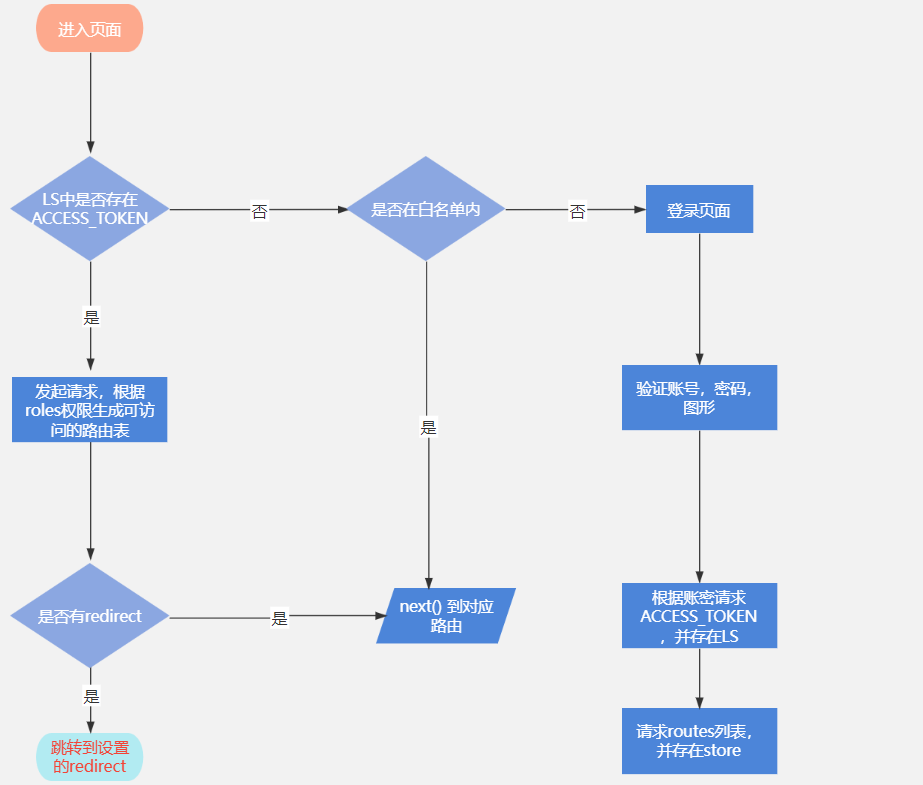

### 前言
此文档为前端项目的说明文档，后续可能会有所细微变动，一切以当前项目为准

### 核心技术栈
|  技术栈   | 版本  |  说明  |
|  ----  | ----  |  ----   |
| vue  | 2.6.12 | 考虑到浏览器兼容要求，使用的vue2作为启动框架  |
| vuex  | 3.6.2 |  --  |
| vue-router  | 3.5.1 |  --  |
| ant-design-vue | 1.7.8 |  ui组件库[链接](https://1x.antdv.com/docs/vue/introduce-cn/)  |
| axios | 0.21.1 |  ui组件库[链接](https://1x.antdv.com/docs/vue/introduce-cn/)  |
| js-cookie | 0.21.1 |  cookie组件库[链接](https://github.com/js-cookie/js-cookie)  |
| vue-ls | 3.2.2 |  基于vue封装的localstorge库[链接](https://github.com/RobinCK/vue-ls)  |

### 项目目录
```
├─config // 配置文件
|  ├─plugin.config.js // ant主题配置，解决本地样式覆盖
├─public
|  ├─mock // mock 数据
|  ├─index.html // 入口文件
├─src
|  ├─api // api接口
|  ├─assets // 静态资源 图片
|  ├─components // 公共组件
|  |  ├─Table // 表格组件，核心文件ProTable.js
|  ├─config
|  |  ├─defaultSettings // 项目默认配置项,包括默认主题布局方式等
|  |  ├─projectConfig // 项目基本信息配置，包括标题，国际化语言
|  ├─core
|  |  ├─lazy_lib // 依赖库的懒加载配置
|  |  ├─bootstrap // 项目布局、国际化相关配置
|  |  ├─icons // 自定义图标加载表
|  ├─layouts // 基本html结构组件
|  ├─locales // 多语言配置
|  ├─locales // 多语言配置
|  ├─mixins // 公共逻辑mixins
|  |  ├─formMixin // 公共表单逻辑组件
|  |  ├─pageFormMixin // 页面表单组件
|  |  ├─popUpFormMixin // 弹窗表单组件
|  ├─router // 路由
|  |  ├─constantRouter // 基础路由：前端自定义的路由
|  |  ├─dynamicRouter // 动态路由：根据后端返回的接口数据，生成的路由
|  ├─static // 静态资源，和assets区别在于，本目录下文件几乎不改动
|  |  ├─weather.js // 页面天气的配置文件
|  ├─store // vuex
|  ├─utils // 工具
|  |  ├─authorize // 权限指令，可用于后端返回的数据控制元素显隐 
|  |  ├─request // axios请求封装
|  |  ├─treeUtil // 数组转属性结构
|  |  ├─password // 密码加密
|  ├─views // 页面组件代码
├─main.js // 入口文件
├─permission.js // 路由守卫 权限控制
├─vue.config.js
├─README.md
├─package.json
└── ...
```

### 路由
整体流程如下图：


整体路由包括基础路由以及动态路由两个部分

#### 基础路由
**其实就是前端自定义的路由**，也可以理解成非菜单页面路由，用于区分后台配置的路由（下面会详细叙述）。主要是包括请求错误的页面（403/404/500等错误页面），以及其他非菜单页面，具体可见`src\router\constantRouter.js`文件

#### 菜单路由
**其实就是在后台页面配置后，生成的路由名称，路径**，主要是为了统一菜单页面风格，权限。具体可见`src\router\dynamicRouter.js`文件

正确输入账号、密码、验证码后，会根据账号，密码请求当前role的routes权限列表，返回的routes结构为：
```javascript
[
  {
    hidden: 1, // 是否显示在菜单栏 1：显示  0：隐藏
    icon: "user", // 菜单栏左侧图标
    id: 10028, // id
    keepAlive: 0, // 是否需要缓存 1：是  0：否
    parentId: 0, // 用于数组转树形结构
    path: "account", // route path
    remarks: "", // 备注
    targetType: 1, // 是否是内置组件 1：内置组件 2：内嵌iframe 3：外链
    title: "个人页", // 路由title，用于面包屑等
    type: 1, // 是否需要拼接组件地址 1：是  0：否
    uri: "account/settings/Index" // views下的所在的组件文件位置
  }
]
```

#### 如何配置菜单的路由

**配置菜单路由需要开通管理员权限，否则菜单栏没有系统配置菜单**

1. 进入菜单权限页面，如果是根菜单，点击新建，如果是子菜单，在对应的子菜单处点击添加按钮
2. 按照提示填写菜单ID，名称，是否显隐，是否是内部菜单，菜单图标等
3. 名称国际化填写菜单的英文标识即可
4. 路由路径：即路由的path，对应返回的path
5. 资源路径：即文件的位置，对应返回的uri

### 如何请求接口

1. 基于`axios`做了二次封装，主要做了请求拦截、请求失败处理、请求响应处理，请求方法封装等
文件位置`src\utils\request.js`

2. 按照对应业务模块，在`api`文件夹内书写对应的请求，大致写法如下：
```javascript
import request from '@/utils/request'

// post示例
export function upDateSoft(data) {
  return request({
    url: '/biz/zb/application/edge/software/update',
    method: 'post',
    data
  })
}

// get示例
export function getParamList(query) {
  return request({
    url: '/biz/zb/appEdgeParam/list',
    method: 'get',
    params: query
  })
}
```

3. 在对应组件中引入并发起请求
```javascript
import { upDateSoft, getParamList } from '@/api/zb/application'
import { doRequest } from '@/utils/request'

const params = {
  applicationId: data.id
}

doRequest(getParamList(params), {
  onSuccess: (res) => {
    // console.log(res);
  }
})

// 或者使用async wait
const { code, message: msg } = await upDateSoft(data)

if (code !== 200) {
  messages.error(msg)
} else {
  message.success('升级成功！')
}
```

#### 请求代理
1. 本地代理：本地使用vue-cli自带的代理配置，具体在`vue.config.js`中
```javascript
const serverAddress = 'http://xxx' // 需要代理的地址
 devServer: {
    proxy: {
      '^/api': { // 此前缀需要与后端统一，否则生产环境会出问题
        target: serverAddress,
        changeOrigin: true, // 是否开启代理
        ws: true, // ws 的请求是否需要代理
        pathRewrite: {  // 是否需要重写

        }
      },
      // 目前只有api前缀代理，如有新增，在这按上面格式新增
    }
  },
```

2. 生产代理：生产环境代理一般由后端配置nginx

### 表格组件 ProTable
由于本项目页面有较多的表格，故在原生的`antd Table`的初始上进行了一层封装，具体逻辑可见：`src\components\Table\ProTable.js`
支持原生 `Antd Table` 的所有 prop，具体配置参看 Antd Vue [官方文档](https://antdv.com/components/table-cn/#Table)
#### ProTable 额外属性
除原生 `Antd Table` 的所有 prop之外, ProTable 还额外提供了一些配置属性，以下介绍主要几种

1. **request**： 获取 `dataSource` 的方法
2. **responseDataProcess**：再 request 获取到 responseData 后，将其处理的方法
3. **lazyLoad**：是否延迟加载，默认表格初始化时即会调用 request
4. **showPagination**：是否展示表格自带的分页器
5. **onPaginationChange**：分页属性改变事件，主要用于自定义的分页器

#### 如何传递额外的查询条件
表格需要额外传参时，可以将 axios 方法包装一层，在调用前使用 Object.assign 进行参数合并

```javascript
tableRequest: (requestParam) => {
  return getPage(Object.assign({}, requestParam, { yourParam: 'test' }))
},

```
#### 如何在外部调用表格方法或者属性
先使用 ref 持有 ProTable 的引用
```html
<pro-table ref="table"></pro-table>
```
再利用 ref 调用组件提供的方法

```javascript
 this.$refs.table.reloadTable(withFirstPage)
```
获取表格的一些状态属性同理，比如一个按钮的 loading 状态需要和表格同步，可以通过表格的 localLoading 参数进行同步

```html
<a-button :loading="$refs.table ? $refs.table.localLoading : false">
```
### 字典组件
主要用于缓存字典数据，减少和服务端的交互，提高渲染效率。主要逻辑可以看`/src/components/Dict/dictPlugin.js`、`/src/store/modules/dict.js`
字典数据，将在第一次从服务端返回时被存储到 LocalStorage，且缓存到 vuex 中，后续使用时从 vuex 中读取，不再请求服务端

#### 组件使用
字典组件分为 `display` 和 `group` 两类。

`display` ：主要针对某一个表单项的渲染，根据表单项的值，转换为对应的样式显示，内容文字即为表单项的文本。

`group`：一组字典项的集合，一般用于根据指定 dict-code 对应的一组字典项数据，渲染一个 select，radio group 等表单选择组件

#### display 类型组件

1. `dict-tag`
包装了一个a-tag，主要用于表格，或者部分详情页根据字典数据回显为一个 tag 标签。

默认标签显示色为灰色，用户可以在 系统管理 => 字典管理 => 字典项 中对各个字典项进行编辑，指定其显示的标签颜色。
**使用方法**：
```html
<dict-tag dict-code="operation_type" :value="dict-value" />
```
2. `dict-text`
使用方式和 dict-tag 基本一致，只是其显示方式是纯文字而已。同样可以在字典项中定制其显示的文本颜色：
html: 
```html
<dict-text dict-code="running_monitor_refresh_time" :value="text" />
```

js:
```javascript
 watch: {
    dictDataCache(value){
      // 逻辑处理，例如：
      this.refreshTime = value.running_monitor_refresh_time.dictItems.find(item => item.name === 'num').value
    },
```
#### grpoup 类型组件
**使用方法**：
1. `dict-select`
根据字典项生成的 select 下拉框
```html
<dict-select placeholder="字典类型"
    v-decorator="['editable']"
    dict-code="dict_property">
</dict-select>
```

2. `dict-radio-group`
字典Radio组件，类似于 DictSelet，只不过其默认渲染出来的时Radio Group

```html
<dict-radio-group
    v-decorator="['editable']"
    dict-code="dict_property">
</dict-radio-group>
```

3. `dict-check-box-group`
字典 CheckBox 组件

```html
<dict-check-box-group
    v-decorator="['editable']"
    dict-code="dict_property">
</dict-check-box-group>
```

### 前端部署
#### 代码构建
只需要在前端项目根路径执行如下命令之一，即可完成构建。
```shell
$ yarn build
or
$ npm run build
```

#### Nginx 配置
示例配置如下，可按需调整：
```nginx
server {
    listen  80;  # 监听 80 端口
    server_name preview.ballcat.cn; # 匹配的域名

    # gzip 压缩配置，建议开启
    gzip on;
    gzip_min_length 1k;
    gzip_buffers 4 16k;
    gzip_comp_level 6;
    gzip_types text/plain application/x-javascript text/css application/xml text/javascript application/x-httpd-php image/jpeg image/gif image/png;
    gzip_disable "MSIE [1-6]\.";
    gzip_vary on;	

    # 根路径跳转前端打包好的 dist 文件目录
    location / {
        root /usr/local/ballcat/dist; # 这里是服务端 dist 文件夹路径
        index index.html;
        # 用于配合 router History 模式使用
        try_files $uri $uri/ /index.html;
    }

    # 对当前域名下以 /api 开头的请求进行转发
    location ^~/api/ {
        # 转发到对应的服务端地址，并截取 /api 的前缀
        proxy_pass http://127.0.0.1:8080/;
        proxy_set_header   Host    $host;
        proxy_set_header   X-Real-IP   $remote_addr;
        proxy_set_header   X-Forwarded-For $proxy_add_x_forwarded_for;

        # 开启 websocket 则需添加如下配置
        proxy_http_version 1.1;
        proxy_set_header Upgrade $http_upgrade;
        proxy_set_header Connection "upgrade";
        proxy_connect_timeout 60s;
        proxy_read_timeout 120s;
        proxy_send_timeout 120s;
    }
}
```